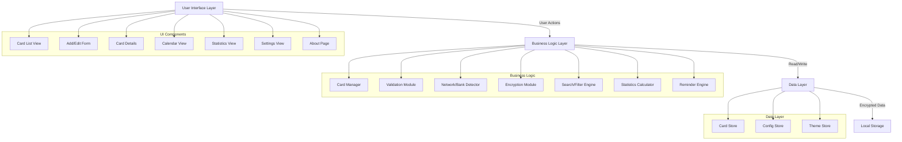

# Design Document: Offline-First Card Manager

## Overview

The Card Manager is a progressive web application that enables users to securely manage credit and debit card information entirely offline. The system is designed with a beginner-friendly vanilla JavaScript foundation that can evolve into a React-based architecture as the developer's skills advance.

### Core Design Principles

1. **Offline-First Architecture**: All functionality works without network connectivity using browser local storage
2. **Security by Default**: Client-side encryption protects sensitive data (card numbers, CVVs) at rest
3. **Progressive Enhancement**: Start with vanilla HTML/CSS/JS, designed for future React migration
4. **Responsive Design**: Mobile-first approach with touch-friendly interfaces
5. **Visual Clarity**: Network logos and bank color themes for quick card identification
6. **Data Portability**: Encrypted export/import for backup and transfer

### Technology Stack

**Current Implementation (Beginner-Friendly)**:
- HTML5 for semantic structure
- CSS3 with CSS Grid and Flexbox for layouts
- Vanilla JavaScript (ES6+) for logic
- Web Crypto API for encryption
- Local Storage API for persistence
- No build tools or bundlers required

**Future Migration Path**:
- React for component architecture
- React Router for navigation
- Context API or Redux for state management
- Component-based CSS (CSS Modules or Styled Components)

## Architecture

### System Architecture Diagram



### Layered Architecture

**Presentation Layer (UI)**:
- Vanilla JavaScript DOM manipulation
- Event handlers for user interactions
- Template rendering functions
- Responsive CSS layouts

**Business Logic Layer**:
- Card management operations (CRUD)
- Validation logic (Luhn algorithm, date validation)
- Card network and bank detection algorithms
- Encryption/decryption operations
- Search, filter, and sort logic
- Statistics calculations
- Payment reminder calculations

**Data Layer**:
- Local Storage abstraction
- Data serialization/deserialization
- Encrypted storage for sensitive fields
- Configuration persistence

### Module Structure

```
card-manager/
├── index.html              # Main entry point
├── css/
│   ├── main.css           # Global styles and variables
│   ├── components.css     # Reusable component styles
│   ├── layouts.css        # Page layouts
│   └── themes.css         # Dark/light theme definitions
├── js/
│   ├── app.js             # Application initialization
│   ├── router.js          # Client-side routing
│   ├── models/
│   │   └── card.js        # Card data model
│   ├── services/
│   │   ├── cardStore.js   # Local storage operations
│   │   ├── encryption.js  # Crypto operations
│   │   ├── validator.js   # Validation logic
│   │   ├── detector.js    # Network/bank detection
│   │   └── statistics.js  # Statistics calculations
│   ├── controllers/
│   │   ├── cardController.js      # Card CRUD operations
│   │   ├── searchController.js    # Search/filter logic
│   │   └── reminderController.js  # Payment reminders
│   └── views/
│       ├── cardList.js    # Card list rendering
│       ├── cardForm.js    # Add/edit form
│       ├── cardDetail.js  # Card details view
│       ├── calendar.js    # Calendar view
│       ├── statistics.js  # Statistics view
│       ├── settings.js    # Settings view
│       └── about.js       # About page
├── assets/
│   ├── logos/
│   │   ├── networks/      # Visa, Mastercard, etc.
│   │   └── banks/         # Bank logos
│   └── icons/             # UI icons
└── data/
    └── bankColors.json    # Default bank color themes
```

### State Management

**Current Approach (Vanilla JS)**:
- Global state object in memory
- Event-driven updates using CustomEvents
- Local storage as source of truth
- Session storage for encryption key

**Future React Approach**:
- React Context for global state
- Component-level state for UI
- Custom hooks for data operations
- Same storage strategy

## Components and Interfaces

### Core Components

#### 1. Card List Component

**Purpose**: Display all cards with search, filter, and sort capabilities

**Interface**:
```javascript
class CardListView {
  constructor(container, cardController, searchController)
  render(cards)
  renderCard(card)
  attachEventListeners()
  handleSearch(query)
  handleFilter(filterType, filterValue)
  handleSort(sortBy)
}
```

**UI Elements**:
- Search bar (filters by name, bank, network)
- Filter dropdowns (network, bank, tags)
- Sort dropdown (name, expiry, age)
- Card grid/list with:
  - Network logo
  - Card name
  - Masked card number (last 4 digits)
  - Expiry date
  - Bank color theme background

#### 2. Card Form Component

**Purpose**: Add or edit card information

**Interface**:
```javascript
class CardFormView {
  constructor(container, cardController, validator, detector)
  render(card = null) // null for add, card object for edit
  attachEventListeners()
  handleSubmit(event)
  handleCardNumberInput(event)
  validateForm()
  showValidationErrors(errors)
}
```

**Form Fields**:
- Card Name* (text, required)
- Card Number* (text, required, Luhn validation)
- CVV* (text, required, 3-4 digits)
- Expiry Date* (month/year, required, future date)
- Issue Date (month/year, optional, past date)
- Statement Generation Date (day of month, optional)
- Payment Due Date (day of month, optional)
- Annual Fee (number, optional)
- Credit Limit (number, optional)
- Shared Limit (dropdown, optional, same bank only)
- Tags (multi-select, optional)
- Enable Notifications (toggle, optional)
- Reminder Period (dropdown, optional, if notifications enabled)

#### 3. Card Details Component

**Purpose**: Display full card information with secure reveal

**Interface**:
```javascript
class CardDetailView {
  constructor(container, cardController, crypto)
  render(cardId)
  revealCVV()
  revealCardNumber()
  copyToClipboard(value)
  calculateCardAge(issueDate)
  attachEventListeners()
}
```

**Display Sections**:
- Card header (name, network logo, bank logo)
- Basic info (expiry, issue date, age)
- Secure fields (card number and CVV with reveal/copy)
- Financial info (credit limit, annual fee, shared limit)
- Billing info (statement date, due date)
- Tags
- Action buttons (edit, delete)

#### 4. Calendar Component

**Purpose**: Visualize statement cycles and due dates

**Interface**:
```javascript
class CalendarView {
  constructor(container, reminderController)
  render(month, year)
  renderMonth(month, year)
  highlightDates(events)
  handleDateClick(date)
  showCardsForDate(date, cards)
  navigateMonth(direction)
}
```

**Features**:
- Month/year navigation
- Color-coded events (statement generation, due dates)
- Click to see cards with events on that date
- Legend for event types

#### 5. Statistics Component

**Purpose**: Display card portfolio analytics

**Interface**:
```javascript
class StatisticsView {
  constructor(container, statisticsService)
  render(stats)
  renderOverallStats(stats)
  renderNetworkBreakdown(stats)
  renderBankBreakdown(stats)
  renderCharts(stats) // Future enhancement
}
```

**Statistics Displayed**:
- Total cards
- Total annual fees
- Total credit limit (accounting for shared limits)
- Average card age
- Breakdown by network
- Breakdown by bank
- Cards expiring soon

#### 6. Settings Component

**Purpose**: Configure application preferences

**Interface**:
```javascript
class SettingsView {
  constructor(container, configStore)
  render(config)
  handleThemeChange(theme)
  handleDateFormatChange(format)
  handleBankColorCustomization(bank, color)
  handleExport()
  handleImport(file)
  attachEventListeners()
}
```

**Settings**:
- Theme toggle (light/dark)
- Date format selector
- Bank color customization
- Export data (with password)
- Import data (with password)
- Master password change

### Service Modules

#### Card Store Service

**Purpose**: Abstract local storage operations

**Interface**:
```javascript
class CardStore {
  constructor(crypto)
  
  // CRUD operations
  async getAllCards()
  async getCardById(id)
  async addCard(card)
  async updateCard(id, card)
  async deleteCard(id)
  
  // Encryption integration
  async encryptSensitiveFields(card)
  async decryptSensitiveFields(card)
  
  // Utility
  generateId()
  validateStorage()
}
```

**Storage Schema**:
```javascript
{
  "cards": [
    {
      "id": "uuid",
      "name": "string",
      "number": "encrypted_string",
      "cvv": "encrypted_string",
      "expiry": "YYYY-MM",
      "issueDate": "YYYY-MM",
      "statementDate": 1-31,
      "dueDate": 1-31,
      "annualFee": number,
      "creditLimit": number,
      "sharedLimitWith": ["card_id"],
      "tags": ["string"],
      "network": "string",
      "bank": "string",
      "notificationsEnabled": boolean,
      "reminderPeriod": 1|3|7|0,
      "createdAt": "ISO_date",
      "updatedAt": "ISO_date"
    }
  ],
  "config": {
    "theme": "light|dark",
    "dateFormat": "DD/MM/YYYY|MM/DD/YYYY|YYYY-MM-DD",
    "bankColors": {
      "bank_name": "#hexcolor"
    }
  },
  "encryptionSalt": "string"
}
```

#### Encryption Service

**Purpose**: Handle all cryptographic operations

**Interface**:
```javascript
class EncryptionService {
  constructor()
  
  // Key management
  async initializeMasterPassword(password)
  async verifyMasterPassword(password)
  async deriveKey(password, salt)
  storeKeyInSession(key)
  getKeyFromSession()
  clearSession()
  
  // Encryption/Decryption
  async encrypt(plaintext, key)
  async decrypt(ciphertext, key)
  
  // Export/Import
  async encryptExport(data, password)
  async decryptImport(encryptedData, password)
}
```

**Encryption Strategy**:
- Use Web Crypto API (AES-GCM 256-bit)
- PBKDF2 for key derivation from master password
- Random salt stored in local storage
- Random IV for each encryption operation
- Encryption key stored in session storage only
- Card numbers and CVVs encrypted at rest
- Export files fully encrypted with user-provided password

#### Validator Service

**Purpose**: Validate card data

**Interface**:
```javascript
class ValidatorService {
  validateCardNumber(number)
  luhnCheck(number)
  validateCVV(cvv)
  validateExpiryDate(expiry)
  validateIssueDate(issueDate)
  validateRequiredFields(card)
  validateForm(formData)
}
```

**Validation Rules**:
- Card number: Luhn algorithm, 13-19 digits
- CVV: 3-4 digits
- Expiry: MM/YYYY format, future date
- Issue date: MM/YYYY format, not future
- Statement/due dates: 1-31
- Credit limit: positive number
- Annual fee: positive number

#### Detector Service

**Purpose**: Detect card network and issuing bank

**Interface**:
```javascript
class DetectorService {
  detectNetwork(cardNumber)
  detectBank(cardNumber)
  getNetworkLogo(network)
  getBankLogo(bank)
  getBankColor(bank)
}
```

**Detection Algorithms**:

Card Network Detection (BIN-based):
```javascript
const NETWORK_PATTERNS = {
  'Visa': /^4/,
  'Mastercard': /^(5[1-5]|2[2-7])/,
  'American Express': /^3[47]/,
  'RuPay': /^(6|60|65|81|82|508)/,
  'Diners Club': /^(36|38|30[0-5])/,
  'Discover': /^(6011|65|64[4-9]|622)/
};
```

Bank Detection (BIN ranges):
```javascript
const BANK_BINS = {
  'HDFC Bank': ['4', '5'],  // Simplified - actual BINs more specific
  'ICICI Bank': ['4', '5'],
  'SBI': ['4', '6'],
  'Axis Bank': ['4', '5'],
  'Kotak Mahindra': ['4', '5'],
  // ... more banks with specific BIN ranges
};
```

#### Statistics Service

**Purpose**: Calculate portfolio statistics

**Interface**:
```javascript
class StatisticsService {
  constructor(cardStore)
  
  async calculateOverallStats()
  async calculateNetworkStats()
  async calculateBankStats()
  calculateTotalCreditLimit(cards)
  calculateAverageAge(cards)
  findExpiringCards(cards, months = 3)
  calculateTotalFees(cards)
}
```

#### Reminder Service

**Purpose**: Calculate payment reminders

**Interface**:
```javascript
class ReminderController {
  constructor(cardStore)
  
  async getUpcomingReminders()
  calculateNextDueDate(card, fromDate = new Date())
  shouldShowReminder(card, dueDate)
  getRemindersForDate(date)
  updateStatementCycle(card)
}
```

**Reminder Logic**:
- Calculate next due date based on statement cycle
- Check if current date is within reminder period
- Only show for cards with notifications enabled
- Sort by due date ascending
- Auto-advance to next cycle after due date passes

## Data Models

### Card Model

```javascript
class Card {
  constructor(data) {
    this.id = data.id || generateUUID();
    this.name = data.name;
    this.number = data.number;  // Encrypted in storage
    this.cvv = data.cvv;        // Encrypted in storage
    this.expiry = data.expiry;  // YYYY-MM format
    this.issueDate = data.issueDate || null;  // YYYY-MM format
    this.statementDate = data.statementDate || null;  // 1-31
    this.dueDate = data.dueDate || null;  // 1-31
    this.annualFee = data.annualFee || 0;
    this.creditLimit = data.creditLimit || 0;
    this.sharedLimitWith = data.sharedLimitWith || [];
    this.tags = data.tags || [];
    this.network = data.network || 'Unknown';
    this.bank = data.bank || 'Unknown';
    this.notificationsEnabled = data.notificationsEnabled || false;
    this.reminderPeriod = data.reminderPeriod || 3;  // days
    this.createdAt = data.createdAt || new Date().toISOString();
    this.updatedAt = new Date().toISOString();
  }
  
  // Computed properties
  get maskedNumber() {
    if (!this.number) return '****';
    return '•••• ' + this.number.slice(-4);
  }
  
  get age() {
    if (!this.issueDate) return null;
    const issue = new Date(this.issueDate);
    const now = new Date();
    const months = (now.getFullYear() - issue.getFullYear()) * 12 
                   + (now.getMonth() - issue.getMonth());
    const years = Math.floor(months / 12);
    const remainingMonths = months % 12;
    return { years, months: remainingMonths, totalMonths: months };
  }
  
  get isExpired() {
    const [year, month] = this.expiry.split('-').map(Number);
    const expiryDate = new Date(year, month, 0);  // Last day of expiry month
    return expiryDate < new Date();
  }
  
  get isExpiringSoon() {
    const [year, month] = this.expiry.split('-').map(Number);
    const expiryDate = new Date(year, month, 0);
    const threeMonthsFromNow = new Date();
    threeMonthsFromNow.setMonth(threeMonthsFromNow.getMonth() + 3);
    return expiryDate <= threeMonthsFromNow && !this.isExpired;
  }
  
  validate() {
    const errors = [];
    if (!this.name) errors.push('Card name is required');
    if (!this.number) errors.push('Card number is required');
    if (!this.cvv) errors.push('CVV is required');
    if (!this.expiry) errors.push('Expiry date is required');
    return errors;
  }
  
  toJSON() {
    return {
      id: this.id,
      name: this.name,
      number: this.number,
      cvv: this.cvv,
      expiry: this.expiry,
      issueDate: this.issueDate,
      statementDate: this.statementDate,
      dueDate: this.dueDate,
      annualFee: this.annualFee,
      creditLimit: this.creditLimit,
      sharedLimitWith: this.sharedLimitWith,
      tags: this.tags,
      network: this.network,
      bank: this.bank,
      notificationsEnabled: this.notificationsEnabled,
      reminderPeriod: this.reminderPeriod,
      createdAt: this.createdAt,
      updatedAt: this.updatedAt
    };
  }
}
```

### Configuration Model

```javascript
class AppConfig {
  constructor(data = {}) {
    this.theme = data.theme || 'light';
    this.dateFormat = data.dateFormat || 'DD/MM/YYYY';
    this.bankColors = data.bankColors || DEFAULT_BANK_COLORS;
  }
  
  toJSON() {
    return {
      theme: this.theme,
      dateFormat: this.dateFormat,
      bankColors: this.bankColors
    };
  }
}
```

### Export Package Model

```javascript
class ExportPackage {
  constructor(data) {
    this.version = '1.0.0';
    this.exportDate = new Date().toISOString();
    this.cards = data.cards;
    this.config = data.config;
  }
  
  toJSON() {
    return {
      version: this.version,
      exportDate: this.exportDate,
      cards: this.cards,
      config: this.config
    };
  }
}
```


## UI/UX Design

### Visual Identity System

#### Color Palette

**Light Theme**:
```css
:root {
  --primary: #2563eb;        /* Blue for primary actions */
  --secondary: #64748b;      /* Slate for secondary elements */
  --success: #10b981;        /* Green for success states */
  --warning: #f59e0b;        /* Amber for warnings */
  --danger: #ef4444;         /* Red for errors/delete */
  --background: #ffffff;     /* White background */
  --surface: #f8fafc;        /* Light gray for cards */
  --text-primary: #0f172a;   /* Dark text */
  --text-secondary: #64748b; /* Gray text */
  --border: #e2e8f0;         /* Light borders */
}
```

**Dark Theme**:
```css
:root[data-theme="dark"] {
  --primary: #3b82f6;
  --secondary: #94a3b8;
  --success: #34d399;
  --warning: #fbbf24;
  --danger: #f87171;
  --background: #0f172a;
  --surface: #1e293b;
  --text-primary: #f1f5f9;
  --text-secondary: #94a3b8;
  --border: #334155;
}
```

#### Default Bank Color Themes

```javascript
const DEFAULT_BANK_COLORS = {
  'HDFC Bank': '#004C8F',
  'ICICI Bank': '#F37021',
  'State Bank of India': '#22409A',
  'Axis Bank': '#800000',
  'Kotak Mahindra Bank': '#ED232A',
  'HSBC': '#DB0011',
  'Citibank': '#056DAE',
  'Standard Chartered': '#0072BC',
  'Yes Bank': '#00529B',
  'IndusInd Bank': '#C8102E',
  'Unknown': '#64748b'
};
```

#### Typography

```css
/* Font Stack */
body {
  font-family: -apple-system, BlinkMacSystemFont, 'Segoe UI', 
               Roboto, Oxygen, Ubuntu, Cantarell, sans-serif;
}

/* Type Scale */
--text-xs: 0.75rem;    /* 12px */
--text-sm: 0.875rem;   /* 14px */
--text-base: 1rem;     /* 16px */
--text-lg: 1.125rem;   /* 18px */
--text-xl: 1.25rem;    /* 20px */
--text-2xl: 1.5rem;    /* 24px */
--text-3xl: 1.875rem;  /* 30px */
```

### Page Layouts

#### 1. Card List Page

**Layout Structure**:
```
┌─────────────────────────────────────┐
│ Header: Logo | Search | Add Button  │
├─────────────────────────────────────┤
│ Filters: Network | Bank | Tags      │
│ Sort: Name | Expiry | Age           │
├─────────────────────────────────────┤
│ ┌─────────┐ ┌─────────┐ ┌─────────┐│
│ │ [Logo]  │ │ [Logo]  │ │ [Logo]  ││
│ │ Card 1  │ │ Card 2  │ │ Card 3  ││
│ │ •••• 1234│ │ •••• 5678│ │ •••• 9012││
│ │ 12/2025 │ │ 03/2026 │ │ 08/2024 ││
│ └─────────┘ └─────────┘ └─────────┘│
│ ┌─────────┐ ┌─────────┐            │
│ │ [Logo]  │ │ [Logo]  │            │
│ │ Card 4  │ │ Card 5  │            │
│ └─────────┘ └─────────┘            │
└─────────────────────────────────────┘
```

**Responsive Behavior**:
- Desktop (≥768px): 3-column grid
- Tablet (≥480px): 2-column grid
- Mobile (<480px): 1-column list

**Card Item Design**:
- Bank color theme as background gradient
- Network logo (32x32px) top-left
- Card name (bold, truncated)
- Masked number (monospace font)
- Expiry date with warning if expiring soon
- Hover effect: slight elevation and scale
- Click: navigate to card details

#### 2. Add/Edit Card Form

**Layout Structure**:
```
┌─────────────────────────────────────┐
│ Header: Back | Title | Save Button  │
├─────────────────────────────────────┤
│ Card Preview                         │
│ ┌─────────────────────────────────┐ │
│ │ [Network Logo] [Bank Logo]      │ │
│ │ Card Name                        │ │
│ │ •••• •••• •••• 1234             │ │
│ │ VALID THRU 12/25                │ │
│ └─────────────────────────────────┘ │
├─────────────────────────────────────┤
│ Basic Information                    │
│ ┌─────────────────────────────────┐ │
│ │ Card Name *                     │ │
│ │ Card Number *                   │ │
│ │ CVV *        Expiry Date *      │ │
│ │ Issue Date   (optional)         │ │
│ └─────────────────────────────────┘ │
│                                      │
│ Financial Information                │
│ ┌─────────────────────────────────┐ │
│ │ Credit Limit                    │ │
│ │ Annual Fee                      │ │
│ │ Shared Limit With (dropdown)    │ │
│ └─────────────────────────────────┘ │
│                                      │
│ Billing Information                  │
│ ┌─────────────────────────────────┐ │
│ │ Statement Date (1-31)           │ │
│ │ Due Date (1-31)                 │ │
│ │ [✓] Enable Notifications        │ │
│ │ Reminder Period (dropdown)      │ │
│ └─────────────────────────────────┘ │
│                                      │
│ Tags                                 │
│ ┌─────────────────────────────────┐ │
│ │ [Travel] [Cashback] [+Add]      │ │
│ └─────────────────────────────────┘ │
└─────────────────────────────────────┘
```

**Form Validation**:
- Real-time validation on blur
- Inline error messages below fields
- Network/bank detection on card number input
- Card preview updates as user types
- Disable save button until form is valid

#### 3. Card Details Page

**Layout Structure**:
```
┌─────────────────────────────────────┐
│ Header: Back | Edit | Delete        │
├─────────────────────────────────────┤
│ Card Visual                          │
│ ┌─────────────────────────────────┐ │
│ │ [Network Logo]    [Bank Logo]   │ │
│ │                                  │ │
│ │ Card Name                        │ │
│ │ •••• •••• •••• 1234             │ │
│ │ VALID THRU 12/25                │ │
│ │                                  │ │
│ │ [Show Number] [Copy]            │ │
│ └─────────────────────────────────┘ │
├─────────────────────────────────────┤
│ Secure Information                   │
│ ┌─────────────────────────────────┐ │
│ │ CVV: ••• [Show] [Copy]          │ │
│ └─────────────────────────────────┘ │
├─────────────────────────────────────┤
│ Card Information                     │
│ Issue Date: Jan 2023                 │
│ Card Age: 1 year 2 months            │
│ Expiry: Dec 2025                     │
│                                      │
│ Financial Information                │
│ Credit Limit: ₹2,00,000              │
│ Annual Fee: ₹1,500                   │
│ Shared Limit: Card A, Card B         │
│                                      │
│ Billing Information                  │
│ Statement Date: 5th of each month    │
│ Due Date: 20th of each month         │
│ Next Due: 20 Dec 2024                │
│ Notifications: Enabled (3 days)      │
│                                      │
│ Tags                                 │
│ [Travel] [Cashback] [Premium]        │
└─────────────────────────────────────┘
```

**Security Features**:
- Card number and CVV hidden by default
- Show button reveals one field at a time
- Auto-hide after 30 seconds
- Copy button with visual feedback
- Confirmation dialog for delete action

#### 4. Calendar View

**Layout Structure**:
```
┌─────────────────────────────────────┐
│ Header: < December 2024 >           │
├─────────────────────────────────────┤
│ Legend: ● Statement ● Due Date      │
├─────────────────────────────────────┤
│ Sun Mon Tue Wed Thu Fri Sat         │
│  1   2   3   4  ●5   6   7          │
│  8   9  10  11  12  13  14          │
│ 15  16  17  18  19 ●20  21          │
│ 22  23  24  25  26  27  28          │
│ 29  30  31                          │
└─────────────────────────────────────┘
│ Cards for Selected Date (20th)       │
│ ┌─────────────────────────────────┐ │
│ │ [Logo] HDFC Card - Due Date     │ │
│ │ [Logo] ICICI Card - Due Date    │ │
│ └─────────────────────────────────┘ │
└─────────────────────────────────────┘
```

**Features**:
- Color-coded dots for different event types
- Multiple dots if multiple events on same day
- Click date to see cards with events
- Month navigation arrows
- Today highlighted with border

#### 5. Statistics Page

**Layout Structure**:
```
┌─────────────────────────────────────┐
│ Header: Statistics                   │
├─────────────────────────────────────┤
│ Overall Statistics                   │
│ ┌──────────┐ ┌──────────┐          │
│ │ 12 Cards │ │ ₹18,000  │          │
│ │          │ │ Annual   │          │
│ └──────────┘ └──────────┘          │
│ ┌──────────┐ ┌──────────┐          │
│ │ ₹8,50,000│ │ 2.5 yrs  │          │
│ │ Credit   │ │ Avg Age  │          │
│ └──────────┘ └──────────┘          │
├─────────────────────────────────────┤
│ By Network                           │
│ Visa         6 cards  ₹4,00,000     │
│ Mastercard   4 cards  ₹3,00,000     │
│ RuPay        2 cards  ₹1,50,000     │
├─────────────────────────────────────┤
│ By Bank                              │
│ HDFC Bank    3 cards  ₹3,00,000     │
│ ICICI Bank   3 cards  ₹2,50,000     │
│ Axis Bank    2 cards  ₹1,50,000     │
│ Others       4 cards  ₹1,50,000     │
├─────────────────────────────────────┤
│ Expiring Soon (3 months)             │
│ [Logo] Card Name - Expires 02/2025  │
│ [Logo] Card Name - Expires 03/2025  │
└─────────────────────────────────────┘
```

#### 6. Settings Page

**Layout Structure**:
```
┌─────────────────────────────────────┐
│ Header: Settings                     │
├─────────────────────────────────────┤
│ Appearance                           │
│ Theme: ○ Light ● Dark               │
│ Date Format: [DD/MM/YYYY ▼]         │
├─────────────────────────────────────┤
│ Bank Colors                          │
│ HDFC Bank    [■ #004C8F] [Edit]     │
│ ICICI Bank   [■ #F37021] [Edit]     │
│ SBI          [■ #22409A] [Edit]     │
│ [+ Add Custom Bank]                  │
├─────────────────────────────────────┤
│ Security                             │
│ [Change Master Password]             │
├─────────────────────────────────────┤
│ Data Management                      │
│ [Export Data]                        │
│ [Import Data]                        │
│ [Clear All Data]                     │
└─────────────────────────────────────┘
```

#### 7. About Page

**Layout Structure**:
```
┌─────────────────────────────────────┐
│ Header: About                        │
├─────────────────────────────────────┤
│ Card Manager                         │
│ Version 1.0.0                        │
│                                      │
│ An offline-first card management     │
│ application for secure local storage│
│ of credit and debit card information│
│                                      │
│ Features:                            │
│ • Offline-first architecture         │
│ • Client-side encryption             │
│ • Payment reminders                  │
│ • Statistics and analytics           │
│ • Data export/import                 │
│                                      │
│ [Report a Bug]                       │
│ [View Documentation]                 │
│ [Privacy Policy]                     │
│                                      │
│ Made with ❤️ for learning            │
└─────────────────────────────────────┘
```

### Navigation

**Primary Navigation** (Bottom bar on mobile, sidebar on desktop):
- Home (Card List)
- Add Card
- Calendar
- Statistics
- Settings
- About

**Mobile Navigation**:
```
┌─────────────────────────────────────┐
│                                      │
│         Content Area                 │
│                                      │
└─────────────────────────────────────┘
┌─────────────────────────────────────┐
│ [Home] [+] [Cal] [Stats] [Settings] │
└─────────────────────────────────────┘
```

**Desktop Navigation**:
```
┌──────┬──────────────────────────────┐
│ Logo │                              │
│ Home │                              │
│  +   │      Content Area            │
│ Cal  │                              │
│Stats │                              │
│ Set  │                              │
│About │                              │
└──────┴──────────────────────────────┘
```

### Responsive Design Strategy

**Breakpoints**:
```css
/* Mobile-first approach */
/* Base styles: 0-479px */

@media (min-width: 480px) {
  /* Small tablets */
}

@media (min-width: 768px) {
  /* Tablets and small desktops */
}

@media (min-width: 1024px) {
  /* Desktops */
}

@media (min-width: 1280px) {
  /* Large desktops */
}
```

**Touch-Friendly Design**:
- Minimum touch target: 44x44px
- Adequate spacing between interactive elements
- Swipe gestures for navigation (future enhancement)
- Large, easy-to-tap buttons
- No hover-dependent functionality

### Accessibility

**WCAG 2.1 AA Compliance**:
- Semantic HTML5 elements
- ARIA labels for interactive elements
- Keyboard navigation support
- Focus indicators on all interactive elements
- Color contrast ratio ≥ 4.5:1 for text
- Alt text for logos and icons
- Screen reader friendly labels

**Keyboard Navigation**:
- Tab: Move forward through interactive elements
- Shift+Tab: Move backward
- Enter/Space: Activate buttons
- Escape: Close modals/dialogs
- Arrow keys: Navigate lists and calendar

### Loading States and Feedback

**Loading Indicators**:
- Skeleton screens for initial load
- Spinner for async operations
- Progress bar for export/import

**User Feedback**:
- Toast notifications for success/error
- Inline validation messages
- Confirmation dialogs for destructive actions
- Visual feedback for copy operations
- Disabled state for invalid forms

### Error Handling UI

**Error Types**:
1. Validation errors: Inline below field
2. Storage errors: Toast notification
3. Encryption errors: Modal dialog
4. Import errors: Detailed error message

**Error Message Format**:
```
┌─────────────────────────────────────┐
│ ⚠ Error Title                       │
│                                      │
│ Clear description of what went wrong│
│ and how to fix it.                   │
│                                      │
│ [Retry] [Cancel]                     │
└─────────────────────────────────────┘
```

## Progressive Enhancement Strategy

### Phase 1: Vanilla JavaScript Foundation (Current)

**Goals**:
- Functional offline-first application
- All core features implemented
- Clean, maintainable code structure
- No build tools required

**Implementation**:
- Direct DOM manipulation
- Event delegation for dynamic content
- Template literals for HTML generation
- CSS custom properties for theming
- Local storage for persistence

### Phase 2: Build Tools and Module Bundling

**Enhancements**:
- Introduce Vite or Webpack
- ES6 modules with proper imports/exports
- CSS preprocessing (Sass/PostCSS)
- Asset optimization
- Development server with hot reload

**Migration Steps**:
1. Set up build configuration
2. Convert to ES6 modules
3. Organize imports/exports
4. Add CSS preprocessing
5. Configure production build

### Phase 3: React Migration

**Component Mapping**:
```
Vanilla JS → React Component
─────────────────────────────
CardListView → CardList.jsx
CardFormView → CardForm.jsx
CardDetailView → CardDetail.jsx
CalendarView → Calendar.jsx
StatisticsView → Statistics.jsx
SettingsView → Settings.jsx
AboutView → About.jsx
```

**State Management**:
```javascript
// Context for global state
const AppContext = createContext();

// Custom hooks for data operations
const useCards = () => {
  const [cards, setCards] = useState([]);
  // ... CRUD operations
  return { cards, addCard, updateCard, deleteCard };
};

const useEncryption = () => {
  // ... encryption operations
};
```

**Migration Steps**:
1. Set up React project structure
2. Create component hierarchy
3. Implement Context API for state
4. Convert views to React components
5. Migrate services to custom hooks
6. Add React Router for navigation
7. Test and refine

### Phase 4: Advanced Features

**Potential Enhancements**:
- PWA capabilities (service worker, offline caching)
- Push notifications for payment reminders
- Data sync across devices (optional cloud backup)
- Advanced analytics and charts
- Card usage tracking
- Receipt attachment
- Multi-currency support
- Biometric authentication

## Testing Strategy

### Unit Testing

**Test Framework**: Jest (for React) or Vitest (for vanilla JS)

**Test Coverage**:
- Validation functions (Luhn algorithm, date validation)
- Card network and bank detection
- Statistics calculations
- Date calculations for reminders
- Data model methods
- Encryption/decryption functions

**Example Unit Tests**:
```javascript
describe('ValidatorService', () => {
  test('validates correct card number with Luhn algorithm', () => {
    expect(validator.luhnCheck('4532015112830366')).toBe(true);
  });
  
  test('rejects invalid card number', () => {
    expect(validator.luhnCheck('1234567890123456')).toBe(false);
  });
  
  test('validates future expiry date', () => {
    const futureDate = '2025-12';
    expect(validator.validateExpiryDate(futureDate)).toBe(true);
  });
  
  test('rejects past expiry date', () => {
    const pastDate = '2020-01';
    expect(validator.validateExpiryDate(pastDate)).toBe(false);
  });
});

describe('DetectorService', () => {
  test('detects Visa from card number', () => {
    expect(detector.detectNetwork('4532015112830366')).toBe('Visa');
  });
  
  test('detects Mastercard from card number', () => {
    expect(detector.detectNetwork('5425233430109903')).toBe('Mastercard');
  });
});

describe('Card Model', () => {
  test('calculates card age correctly', () => {
    const card = new Card({
      issueDate: '2022-01',
      // ... other fields
    });
    const age = card.age;
    expect(age.years).toBeGreaterThan(0);
  });
  
  test('identifies expiring cards', () => {
    const card = new Card({
      expiry: '2024-03',
      // ... other fields
    });
    expect(card.isExpiringSoon).toBe(true);
  });
});
```

### Integration Testing

**Test Scenarios**:
- Add card flow (form validation → storage → display)
- Edit card flow (load → modify → save → verify)
- Delete card flow (confirm → remove → verify)
- Search and filter (input → filter → display results)
- Export/import (encrypt → download → upload → decrypt)
- Theme switching (toggle → persist → reload → verify)

### End-to-End Testing

**Test Framework**: Playwright or Cypress

**Test Scenarios**:
1. First-time user setup (master password)
2. Add multiple cards
3. View card details with reveal
4. Edit card information
5. Delete card with confirmation
6. Search and filter cards
7. View calendar with events
8. Check statistics
9. Export data
10. Import data
11. Change settings
12. Switch theme

### Property-Based Testing

Property-based tests will be defined in the Correctness Properties section below, with each property implemented as a test that runs a minimum of 100 iterations with randomized inputs.

**PBT Library**: fast-check (JavaScript)

**Configuration**:
```javascript
import fc from 'fast-check';

// Example property test
test('Property 1: Luhn validation round trip', () => {
  fc.assert(
    fc.property(
      fc.array(fc.integer(0, 9), { minLength: 13, maxLength: 19 }),
      (digits) => {
        // Property test implementation
      }
    ),
    { numRuns: 100 }
  );
});
```

### Manual Testing Checklist

**Functionality**:
- [ ] All CRUD operations work correctly
- [ ] Validation prevents invalid data
- [ ] Encryption/decryption works
- [ ] Search and filters work
- [ ] Statistics calculate correctly
- [ ] Calendar displays events
- [ ] Reminders show at correct times
- [ ] Export/import preserves data

**UI/UX**:
- [ ] Responsive on all screen sizes
- [ ] Touch-friendly on mobile
- [ ] Theme switching works
- [ ] Animations smooth
- [ ] Loading states display
- [ ] Error messages clear

**Security**:
- [ ] Sensitive data encrypted in storage
- [ ] Master password required
- [ ] Session clears on close
- [ ] Export encrypted properly

**Performance**:
- [ ] App loads quickly
- [ ] No lag with 100+ cards
- [ ] Search is instant
- [ ] Smooth animations


## Correctness Properties

*A property is a characteristic or behavior that should hold true across all valid executions of a system—essentially, a formal statement about what the system should do. Properties serve as the bridge between human-readable specifications and machine-verifiable correctness guarantees.*

### Property Reflection

After analyzing all acceptance criteria, I identified the following redundancies and consolidations:

**Redundancies Identified**:
1. Properties 1.1-1.4 (required field validation) can be combined into a single property about required fields
2. Properties 16.3 and 16.4 are identical (shared limit counted once)
3. Properties 16.1 and 16.6 are identical (dropdown filtered by bank)
4. Properties 11.4 and 11.5 can be combined into a round-trip property for theme persistence
5. Properties 12.3 and 12.4 can be combined into a round-trip property for date format persistence
6. Properties 6.5 and 6.6 are part of the same export/import round-trip property
7. Properties 10.2 and 10.5 both test tag persistence and can be combined

**Consolidations**:
- Validation properties grouped by type (required fields, format validation, date validation)
- Storage round-trip properties combined (add/retrieve, export/import, settings persistence)
- Display properties grouped by rendering concerns

### Properties

### Property 1: Required Field Validation

*For any* card form submission, if any required field (card name, card number, CVV, or expiry date) is missing, the validation SHALL reject the submission.

**Validates: Requirements 1.1, 1.2, 1.3, 1.4**

### Property 2: Luhn Algorithm Validation

*For any* card number, the Luhn validation SHALL accept it if and only if the Luhn checksum is valid.

**Validates: Requirements 1.5**

### Property 3: Future Expiry Date Validation

*For any* expiry date, the validation SHALL accept it if and only if the date is in the current month or a future month.

**Validates: Requirements 1.6**

### Property 4: CVV Format Validation

*For any* CVV string, the validation SHALL accept it if and only if it contains exactly 3 or 4 digits.

**Validates: Requirements 1.7**

### Property 5: Past Issue Date Validation

*For any* issue date, the validation SHALL accept it if and only if the date is not in the future.

**Validates: Requirements 1.8**

### Property 6: Card Storage Round Trip

*For any* valid card data, storing the card and then retrieving it SHALL return equivalent card data with all fields preserved.

**Validates: Requirements 1.9, 5.1, 5.2, 5.3**

### Property 7: Network Detection Accuracy

*For any* card number with a known BIN pattern, the network detection SHALL return the correct card network (Visa, Mastercard, American Express, RuPay, Diners Club, or Discover).

**Validates: Requirements 1.10**

### Property 8: Bank Detection Accuracy

*For any* card number with a known BIN range, the bank detection SHALL return the correct issuing bank.

**Validates: Requirements 1.11**

### Property 9: Optional Fields Acceptance

*For any* card form submission with valid required fields, the form SHALL be accepted regardless of whether optional fields (issue date, statement date, due date, annual fee, credit limit, shared limit) are provided.

**Validates: Requirements 1.12**

### Property 10: Sensitive Data Masking

*For any* card, the default display SHALL not contain the full card number or CVV in plaintext.

**Validates: Requirements 2.1**

### Property 11: Clipboard Copy Accuracy

*For any* card field (CVV or card number), copying to clipboard SHALL place the exact unmasked value in the clipboard.

**Validates: Requirements 2.4**

### Property 12: Card Age Calculation

*For any* card with an issue date, the calculated age SHALL equal the number of complete months between the issue date and the current date.

**Validates: Requirements 2.5**

### Property 13: Tag Display Completeness

*For any* card with tags, the rendered card details SHALL include all tags associated with that card.

**Validates: Requirements 2.6**

### Property 14: Edit Validation Consistency

*For any* invalid card data, the validation SHALL reject it in both add and edit operations with the same error messages.

**Validates: Requirements 3.1**

### Property 15: Card Update Persistence

*For any* existing card, updating its fields and saving SHALL result in the storage containing the updated values when retrieved.

**Validates: Requirements 3.3**

### Property 16: Card Deletion Completeness

*For any* card, after deletion is confirmed, the card SHALL no longer exist in storage or appear in any card lists.

**Validates: Requirements 3.5**

### Property 17: Card List Completeness

*For any* collection of stored cards, the rendered card list SHALL include all cards with their names visible.

**Validates: Requirements 4.1**

### Property 18: Search Filter Accuracy

*For any* search query and card collection, all returned results SHALL match the query in at least one of: card name, bank name, or card network.

**Validates: Requirements 4.2**

### Property 19: Sort Order Correctness

*For any* card collection and sort criterion (name, expiry date, or age), the sorted results SHALL be in the correct ascending or descending order for that criterion.

**Validates: Requirements 4.3**

### Property 20: Filter Accuracy

*For any* filter criterion (network, bank, or tag) and card collection, all returned results SHALL match the filter criterion.

**Validates: Requirements 4.4**

### Property 21: Encryption Irreversibility Without Key

*For any* card data and password, encrypting the data SHALL produce output that is different from the input and cannot be decrypted without the correct password.

**Validates: Requirements 6.2, 15.2**

### Property 22: Export Package Structure

*For any* card collection, the generated export package SHALL contain all cards and configuration in a valid JSON structure with version and timestamp metadata.

**Validates: Requirements 6.3**

### Property 23: Export-Import Round Trip

*For any* card collection and password, exporting with the password and then importing with the same password SHALL restore all card data and configuration.

**Validates: Requirements 6.5, 6.6**

### Property 24: Incorrect Password Rejection

*For any* encrypted export package, attempting to decrypt with an incorrect password SHALL fail and prevent data import.

**Validates: Requirements 6.7, 15.6**

### Property 25: Card Count Accuracy

*For any* card collection, the calculated total number of cards SHALL equal the length of the card array.

**Validates: Requirements 7.1**

### Property 26: Annual Fee Sum Accuracy

*For any* card collection, the calculated total annual fees SHALL equal the sum of all individual card annual fees.

**Validates: Requirements 7.2**

### Property 27: Shared Limit Deduplication

*For any* card collection with shared limits, the calculated total credit limit SHALL count each shared limit group only once, not once per card in the group.

**Validates: Requirements 7.3, 16.3, 16.4**

### Property 28: Network Statistics Grouping

*For any* card collection, the statistics grouped by network SHALL include all cards, with each card appearing in exactly one network group.

**Validates: Requirements 7.4**

### Property 29: Average Age Calculation

*For any* card collection where all cards have issue dates, the calculated average age SHALL equal the sum of all card ages divided by the number of cards.

**Validates: Requirements 7.6**

### Property 30: Next Due Date Calculation

*For any* card with statement date and due date, the calculated next due date SHALL be the next occurrence of the due date after the current date, accounting for month boundaries.

**Validates: Requirements 8.4, 8.8**

### Property 31: Reminder Filtering by Notification Status

*For any* card collection, the displayed payment reminders SHALL include only cards with notifications enabled.

**Validates: Requirements 8.6**

### Property 32: Reminder Filtering by Period

*For any* card with notifications enabled and a reminder period, the card SHALL appear in reminders if and only if the current date is within the reminder period before the due date.

**Validates: Requirements 8.5**

### Property 33: Reminder Sort Order

*For any* collection of payment reminders, the displayed reminders SHALL be sorted by due date in ascending order.

**Validates: Requirements 8.7**

### Property 34: Calendar Date Completeness

*For any* card collection, the calendar view SHALL include markers for all statement generation dates and payment due dates from all cards.

**Validates: Requirements 9.1, 9.2, 9.3**

### Property 35: Calendar Date Filtering

*For any* selected date and card collection, clicking the date SHALL display all and only those cards that have a statement date or due date on that date.

**Validates: Requirements 9.4**

### Property 36: Event Color Coding

*For any* calendar event, the event SHALL have a color attribute that corresponds to either the card's bank color or the card's network.

**Validates: Requirements 9.5**

### Property 37: Tag Storage Round Trip

*For any* card with tags, storing the card and retrieving it SHALL preserve all tags in the same order.

**Validates: Requirements 10.2, 10.5**

### Property 38: Tag Filter Accuracy

*For any* tag and card collection, filtering by that tag SHALL return all and only those cards that include the tag in their tags array.

**Validates: Requirements 10.3**

### Property 39: Available Tags Completeness

*For any* card collection, the list of available tags SHALL include all unique tags from all cards.

**Validates: Requirements 10.4**

### Property 40: Theme Persistence Round Trip

*For any* theme selection (light or dark), saving the theme and reloading the application SHALL apply the saved theme.

**Validates: Requirements 11.4, 11.5**

### Property 41: Date Format Application

*For any* date and selected date format (DD/MM/YYYY, MM/DD/YYYY, or YYYY-MM-DD), all displayed dates SHALL be formatted according to the selected format.

**Validates: Requirements 12.2**

### Property 42: Date Format Persistence Round Trip

*For any* date format selection, saving the format and reloading the application SHALL apply the saved format to all dates.

**Validates: Requirements 12.3, 12.4**

### Property 43: Encryption Round Trip

*For any* card number or CVV and encryption key, encrypting and then decrypting SHALL return the original value.

**Validates: Requirements 15.3**

### Property 44: Shared Limit Dropdown Filtering

*For any* card being edited, the shared limit dropdown SHALL contain only cards from the same bank as the current card.

**Validates: Requirements 16.1, 16.6**

### Property 45: Shared Limit Relationship Persistence

*For any* card with shared limit relationships, storing the card and retrieving it SHALL preserve all shared limit relationships.

**Validates: Requirements 16.2**

### Property 46: Shared Limit Display

*For any* card with shared limit relationships, the card details view SHALL display the names or identifiers of all cards that share the limit.

**Validates: Requirements 16.5**

### Property 47: Network Logo Display

*For any* card with a detected network, the card display SHALL include the corresponding network logo.

**Validates: Requirements 17.1**

### Property 48: Bank Logo Display

*For any* card with a detected bank, the card display SHALL include the corresponding bank logo.

**Validates: Requirements 17.2**

### Property 49: Logo Position Consistency

*For any* card in the card list, the network logo SHALL appear before the card name in the rendered output.

**Validates: Requirements 17.5**

### Property 50: Dual Logo Display

*For any* card in the details view, both the network logo and bank logo SHALL be present in the rendered output.

**Validates: Requirements 17.6**

### Property 51: Bank Color Consistency

*For any* collection of cards from the same bank, all cards SHALL have the same color theme applied.

**Validates: Requirements 17.8**

### Property 52: Bank Color Persistence Round Trip

*For any* customized bank color, saving the color and reloading the application SHALL apply the customized color to all cards from that bank.

**Validates: Requirements 17.10**

### Property 53: Placeholder Logo Fallback

*For any* card with an unrecognized network or bank, the display SHALL include a generic placeholder icon instead of failing or showing no icon.

**Validates: Requirements 17.11**

